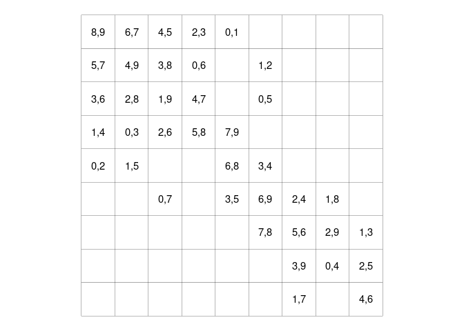

<!-- README.md is generated from README.Rmd. Please edit that file -->

# more-maximal-room-squares

<!-- badges: start -->
<!-- badges: end -->

``` r
n <- 10

r <- Room$new(size = n)

tic()
for(e in r$empty_cells) {
  for(p in r$free_pairs) {
    if(r$is_available(e, p)) {
      r$set(e, p)
      break()
    }
  }
}
toc()
#> 0.334 sec elapsed
```

<!-- -->

# Results

``` r
library(dplyr)
library(here)
library(readr)

results <- read_rds(here("data", "results.rds"))
meszka <- read_rds(here("data", "meszka-rosa-table.rds"))

final_results <- results %>%
  filter(n >= 50) %>%
  group_by(n) %>%
  summarise(t3 = max(n_filled)) %>%
  left_join(meszka) %>%
  mutate(
    `t3 - t1` = t3 - t1,
           r3 = t3/nc2
  ) %>%
  select(n, nc2, t1, t2, t3, r1, r2, r3)

print(final_results, n = Inf)
#> # A tibble: 26 x 8
#>        n   nc2    t1    t2    t3    r1    r2    r3
#>    <dbl> <dbl> <dbl> <dbl> <int> <dbl> <dbl> <dbl>
#>  1    50  1225  1074   973  1094 0.877 0.794 0.893
#>  2    52  1326  1165  1084  1178 0.879 0.817 0.888
#>  3    54  1431  1250  1195  1278 0.874 0.835 0.893
#>  4    56  1540  1346  1303  1376 0.874 0.846 0.894
#>  5    58  1653  1442  1401  1481 0.872 0.848 0.896
#>  6    60  1770  1540  1489  1587 0.87  0.841 0.897
#>  7    62  1891  1652  1596  1699 0.874 0.844 0.898
#>  8    64  2016  1755  1721  1809 0.871 0.854 0.897
#>  9    66  2145  1873  1854  1937 0.873 0.864 0.903
#> 10    68  2278  1993  1988  2060 0.875 0.873 0.904
#> 11    70  2415  2104  2119  2178 0.871 0.877 0.902
#> 12    72  2556  2228  2212  2312 0.872 0.865 0.905
#> 13    74  2701  2354  2291  2439 0.872 0.848 0.903
#> 14    76  2850  2490  2345  2586 0.874 0.823 0.907
#> 15    78  3003  2617  2405  2725 0.871 0.801 0.907
#> 16    80  3160  2765  2460  2872 0.875 0.778 0.909
#> 17    82  3321  2911  2536  3022 0.877 0.764 0.910
#> 18    84  3486  3049  2632  3178 0.875 0.755 0.912
#> 19    86  3655  3204  2742  3328 0.877 0.75  0.911
#> 20    88  3828  3370  2870  3492 0.88  0.75  0.912
#> 21    90  4005  3513  3017  3663 0.877 0.753 0.915
#> 22    92  4186  3674  3178  3824 0.878 0.759 0.914
#> 23    94  4371  3854  3351  3989 0.882 0.767 0.913
#> 24    96  4560  4013  3536  4173 0.88  0.775 0.915
#> 25    98  4753  4178  3733  4357 0.879 0.785 0.917
#> 26   100  4950  4341  3941  4534 0.877 0.796 0.916
```
